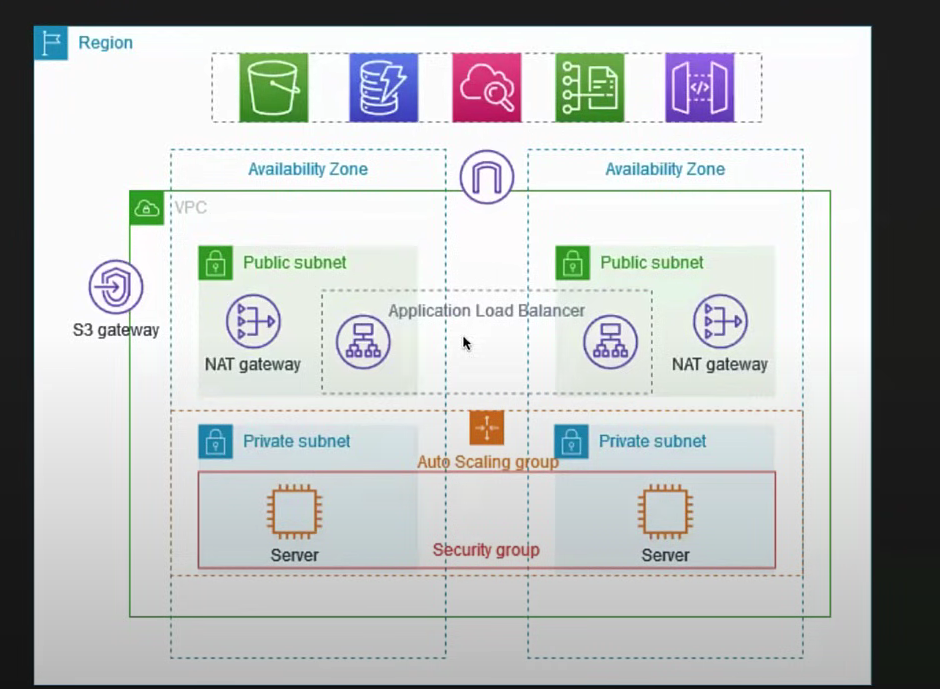

# AWS Production VPC with High Availability and Security

This project provides an example of how to create a Virtual Private Cloud (VPC) on Amazon Web Services (AWS) that is suitable for use in a production environment. The architecture emphasizes **high availability**, **resiliency**, and **security** by leveraging several key AWS services.

---

## Architecture Highlights

- **High Availability and Resiliency**: To ensure the application remains available, the servers are deployed across **two different Availability Zones**. This is achieved using an **Auto Scaling group**, which automatically manages the number of instances and can replace unhealthy ones, and an **Application Load Balancer** (ALB) to distribute incoming traffic.
- **Enhanced Security**: The servers are placed in **private subnets**, which means they are not directly accessible from the public internet. All incoming requests are routed through the public-facing Application Load Balancer. Additionally, a **Bastion Host** is included in a public subnet to provide a secure, controlled point of entry for administrators who need to SSH into the servers in the private subnets. The bastion host acts as a jump server, allowing authorized users to connect to instances in the private subnets without exposing them directly to the internet.
- **Internet Connectivity for Servers**: While the servers are in private subnets, they still need to connect to the internet for tasks like software updates. This is made possible by a **NAT gateway** (Network Address Translation gateway), which is also deployed in **both Availability Zones** to maintain resiliency.

---

## Key AWS Services Used

- **Amazon VPC**: The foundational network environment.
- **Application Load Balancer (ALB)**: Distributes web traffic to your servers.
- **Auto Scaling Group**: Automatically scales the number of EC2 instances based on demand and health checks.
- **NAT Gateway**: Enables instances in a private subnet to connect to the internet.
- **EC2 Instances**: The virtual servers where your application will run, including the **Bastion Host**.
- **Bastion Host**: A bastion host is a dedicated server that provides a single, secure entry point for administrators to access other servers located in private networks.

---

